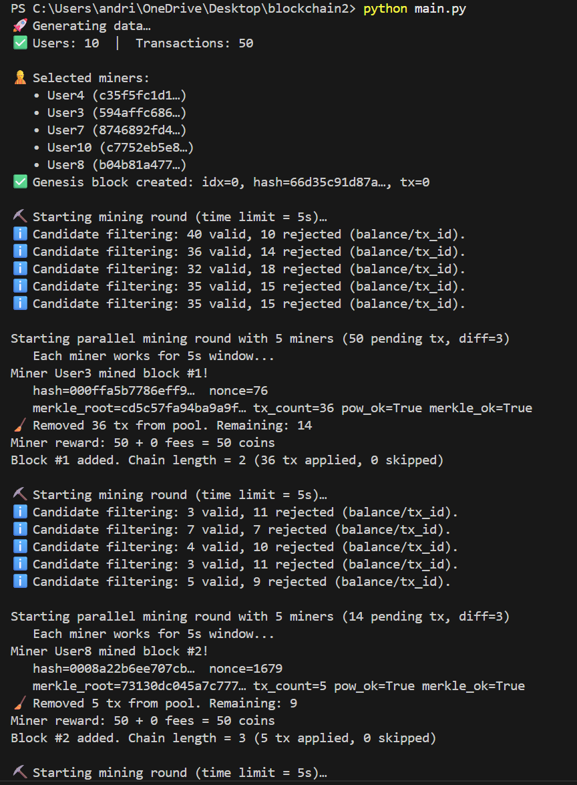
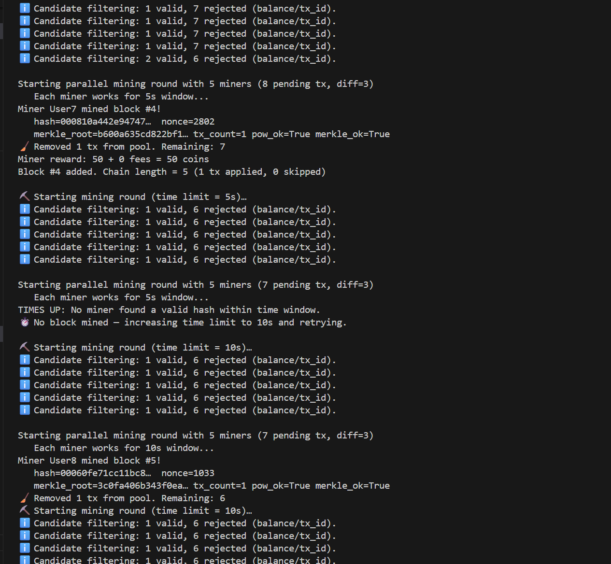
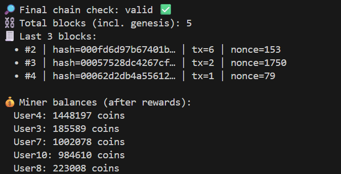
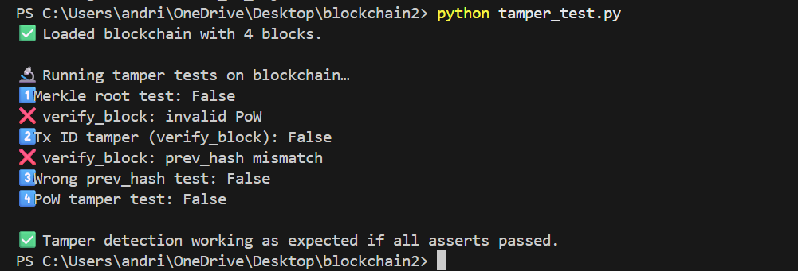
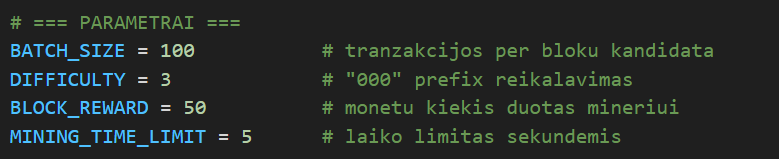

# 🧩 Supaprastinta blokų grandinė – v0.2

**Indėlis:**  
- **Valentinas Šamatovičius** – vartotojų, transakcijų ir blokų kūrimas, individualaus hash algoritmo integravimas, balansų atnaujinimas, lygiagretus kasimas (parallel mining), „Proof-of-Work“ kasimo logika.  
- **Adrius Rakauskas** – Merkle medžio (Merkle Tree) įgyvendinimas, „Proof-of-Work“ kasimo logika, blokų patikrinimo (verification) logika, papildomos validacijos funkcijos, UTXO modelis

---

## 🧱 Projekto aprašymas

Šis projektas sukurtas siekiant praktiškai pavaizduoti, kaip veikia supaprastinta blokų grandinės sistema.  
Sistema imituoja pagrindinius „blockchain“ technologijos veikimo principus: transakcijų kūrimą, blokų formavimą, kriptografinį maišymą (hash), darbo įrodymo algoritmą (Proof-of-Work), kasėjų (miners) konkurenciją bei blokų grandinės validaciją.

Projekto tikslas – sukurti veikiančią decentralizuotos sistemos modelį, kuriame kiekvienas blokas būtų patikimas, tikrinamas ir susietas su ankstesniu.

---
## 📂 Projekto struktūra

```plaintext
Blockchain2/
│
├── user.py              # Vartotojų kūrimas, vieši/privatūs raktai, balansų atnaujinimas
├── transaction.py       # Transakcijų kūrimas, ID generavimas ir hash skaičiavimas
├── block.py             # Vieno bloko duomenys, maišos skaičiavimas, Merkle root (v0.2)
├── blockchain.py        # Pagrindinė blockchain logika, kasimo algoritmas (Proof-of-Work)
├── custom_hash.py       # Individualus hash algoritmas (konvertuotas iš C++)
├── data_gen.py          # Testinių vartotojų ir transakcijų generavimas
├── main.py              # Pagrindinis paleidimo failas (simuliacija ir testavimas)
└── README_v0_2.md       # Projekto dokumentacija


```
---
## 🧩 Projekto eiga

###  Versija v0.1 – pagrindinė struktūra

**Įgyvendinta:**
- Sukurta klasė `User` (vartotojas) su unikaliu vardu, viešu raktu (`public_key`) ir pradiniu balansu.  
- Sukurta klasė `Transaction`, generuojanti siuntėjo ir gavėjo transakcijas bei `tx_id` (naudojant `custom_hash256`).  
- Sukurta klasė `Block`, kurioje talpinamas transakcijų sąrašas, `prev_hash`, `nonce` ir bloko hash.  
- Sukurta klasė `Blockchain`, leidžianti jungti blokus į grandinę.  
- Integruotas individualus hash algoritmas (`custom_hash256`) iš C++ kodo.  

**Rezultatas:**  
Veikianti sistema, galinti sukurti vartotojus, generuoti transakcijas, jungti juos į blokus ir saugoti grandinėje, tačiau dar be kasimo (mining) logikos.

---

### 🟡 Versija v0.2 – išplėstinė blokų grandinė

**Patobulinta:**

- Įdiegta **lygiagretaus kasimo (Parallel Mining)** simuliacija – keli kasėjai vienu metu ieško tinkamo `nonce`.  
- Pridėtas **kasimo laiko limitas (`mining_time_limit`)** – kasėjai dirba tik tam tikrą laiko tarpą.  
- Įgyvendinta **kasėjų atranka ir atlygis** – 50 monetų + galimi mokesčiai už transakcijas.  
- Patobulinta **Proof-of-Work** – dabar keli kasėjai konkuruoja dėl pirmojo tinkamo hash su nulių prefiksu.  
- Įdiegta **transakcijų validacija** – tikrinama, ar siuntėjo balansas pakankamas; neteisingos transakcijos praleidžiamos.  
- Pridėtas **Merkle Tree (Merkle medis)** – kiekvieno bloko transakcijų ID sujungiami į vieną šaknies hash (`merkle_root`), kuris saugomas bloko antraštėje.  
- Įgyvendintas **blokų patikrinimas (Verification)** – tikrinamas `merkle_root`, `prev_hash` ir PoW teisingumas.  
- Automatinis **genesis bloko** kūrimas su 64 nuliais kaip `prev_hash`.  
- Patobulinta **grandinių validacija**, tikrinanti visų blokų nuoseklumą ir PoW.  
- Pagrindinė simuliacija per `main.py`, valdant baseiną (`tx_pool`) ir kasėjų veiklą.  
- Naujoje versijoje pridėtas UTXO (Unspent Transaction Output) modelis, kuris imituoja „Bitcoin“ veikimo principą.
Kiekvienas išėjimas (TxOut) gali būti sunaudotas tik vieną kartą, o kiekviena transakcija nurodo, kuriuos ankstesnius išėjimus (TxIn) ji panaudoja.
Tai leidžia tiksliau pavaizduoti, kaip realiai veikia decentralizuoti tinklai.

### Veikimo/paleidimo pavyzdžiai
Toliau pateiktas pavyzdys rodo, kaip veikia sistema realiu paleidimo metu (python main.py).
Čia matoma:

- Vartotojų ir transakcijų generacija,

- Kelių kasėjų konkurencija,

- Bloko iškasimas (su „Proof-of-Work“),

- Merkle šaknies validacija,

- Grandinės vientisumo patikrinimas ir kasėjų balanso atnaujinimas.







Rezultatas:

- Visi bloko hash atitinka „000“ prefiksą (sėkmingas PoW).

- Kiekvienas blokas turi galiojantį merkle_root.

- Grandinė pažymėta kaip valid (✅), vadinasi, visi blokai nuosekliai susieti ir verifikuoti.

- Kasėjų balansas padidėjo atsižvelgiant į iškastus blokus bei atlygį.

Tai galima toliau patikrinti integralumo teste (python tamper_test.py):




### Naudojimosi instrukcija
Viskas buvo paruošta naudotojo patogumui, tad programos paleidimas, skaitymas, buvo padaryta kiek įmanoma (bent pagal mūsų kompetencijas..) paprasčiau.

Norint paleisti programą, terminale įveskite komandą:

```bash
python main.py
```
Jei jus domina UTXO modelis ir jo paleidimas - jis yra visiškai identiškas:
```bash
python main.py utxo
```
Jei norite ištestuoti, kaip vyksta visi patikrinimai, verifikacijos, tereikia apačioje main.py faile atsikomentuoti 
```bash
  # tamper testui, kitiems panaudojimams blockchaino kaip json failo
   # import json
   # with open("blockchain_v0_2.json", "w") as f:
    #    json.dump(bc.to_dict(), f, indent=2)
   # print("Issaugota blockchain_v0_2.json")
```
Tada dar kartą paleisti paprastai programą, kad būtų sukurtas blockchain'o json failas:

```bash
python main.py
```
Ir pagaliau suvesti:

```bash
python tamper_test.py
```
Verta paminėti, kad main.py taipogi yra parametrai, kurie detaliau aprašyti tenais, ir yra pakeičiami Jūsų nuožiūrai.



**Rezultatai/Išvados:**  
Visiškai funkcionuojanti, decentralizuota blokų grandinės sistema su keliais kasėjais, Proof-of-Work, Merkle medžiu, blokų validacija ir balansų atnaujinimu, lengvu perėjimu tarp UTXO ir paprasto modelio.
Sistema dabar palaiko du veikimo režimus:

„Account“ (sąskaitų modelį) – supaprastintas, balanso pagrindu;

„UTXO“ (Bitcoin tipo modelį) – kiekviena moneta turi savo unikalų išėjimą ir savininką.

Tai leidžia praktiškai pavaizduoti, kaip „Bitcoin“ ir „Ethereum“ tipo grandinės skiriasi architektūriškai, bet veikia tuo pačiu „Proof-of-Work“ principu.

Sistema leidžia:
- Modeliuoti decentralizuotą blokų grandinę su keliais kasėjais;  
- Aptikti bet kokius duomenų pakeitimus („tamper detection“);  
- Pritaikyti lengvai keičiamą, veikiantį sprendimą tiek account, tiek UTXO modeliams.
